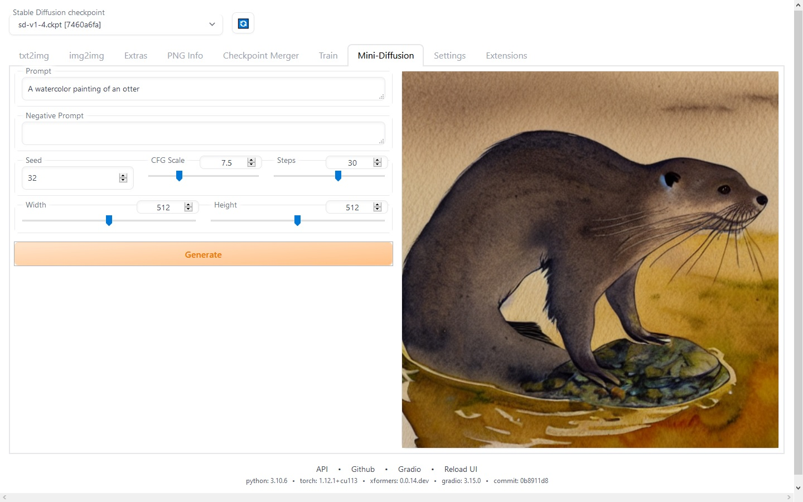

# Mini-diffusion extension for  AUTOMATIC1111/stable-diffusion-webui

This is my attempt to adapt the stable diffusion loop code from:

https://nbviewer.org/github/fastai/diffusion-nbs/blob/master/Stable%20Diffusion%20Deep%20Dive.ipynb

https://www.youtube.com/watch?v=0_BBRNYInx8

inside webui environment, without having to install anything else. This works only for SD1.x.
