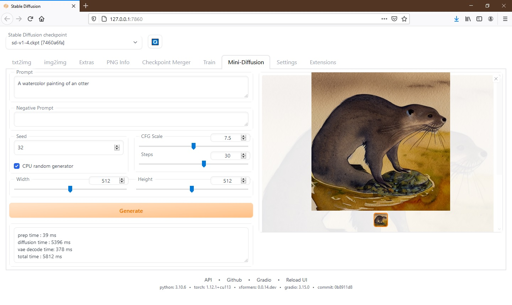

# Mini-diffusion extension for  AUTOMATIC1111/stable-diffusion-webui

This is my attempt to adapt the stable diffusion loop code from:

![https://nbviewer.org/github/fastai/diffusion-nbs/blob/master/Stable%20Diffusion%20Deep%20Dive.ipynb]

linked from the video:

![https://www.youtube.com/watch?v=0_BBRNYInx8]

inside webui environment, without having to install anything else, since I should already have all the files needed. This works only for SD1.x.

I'm not sure if there already exists a low level api to do this, webui code is hard to follow, with lots of layers and wrappers. 

I did this as an exercise in python which I'm still learning.